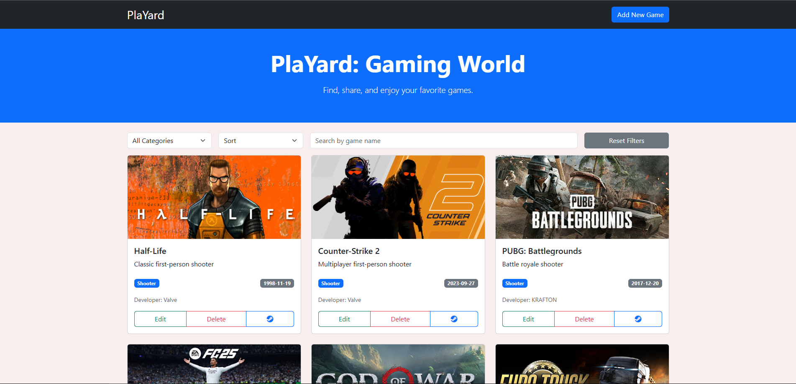

# PlaYard - Game Library Project



## Overview

PlaYard is a web-based game library application that allows users to manage and showcase video games. Users can add, edit, delete, and view detailed information about games, including multiple screenshots, descriptions, and Steam links.

## Features

- **Game Management**: Add, edit, and delete games
- **Image Gallery**: Support for multiple game screenshots with carousel display
- **Filtering System**: Filter games by category and search by name
- **Sorting Options**: Sort games by name (A-Z, Z-A) or release date
- **Responsive Design**: Works seamlessly on desktop and mobile devices
- **Steam Integration**: Direct links to games on Steam

## Technologies Used

- **HTML**
- **CSS**
- **SCSS**
- **JavaScript**
- **Bootstrap**:
- **JSON Server**

## Project Structure

```
Odev2/
├── css/
│   └── main.css
├── scss/
│   └── main.scss
├── js/
│   ├── controllers/
│   │   └── GameController.js
│   ├── models/
│   │   └── Game.js
│   ├── services/
│   │   └── GameService.js
│   ├── UI/
│   │   ├── GameCard.js
│   │   └── ErrorAlert.js
│   ├── utils/
│   │   ├── DOMElements.js
│   │   └── helpers.js
│   └── app.js
└── index.html
```

## Components

### 1. Game Model

The `Game` class represents the data structure for game entries:

- ID
- Name
- Description
- Category
- Release Date
- Images Array (Cover + Screenshots)
- Developer
- Steam URL

### 2. GameService

Handles all data operations:

- Fetching games from the server
- Adding new games
- Updating existing games
- Deleting games

### 3. GameCard

Responsible for creating the visual representation of each game:

- Displays game cover image
- Shows game information in a card format
- Handles edit and delete operations
- Links to Steam store page

## Getting Started

### Prerequisites

- Node.js installed
- JSON Server installed globally (`npm install -g json-server`)

### Installation

1. Clone the repository

```bash
git clone https://github.com/waroi/TurkcellFrontend2025
```

2. Navigate to the project folder

```bash
cd Ogrenciler\FurkanFirat\Odevler\Odev2

```

3. Install dependencies:

```bash
npm install

```

4. Start JSON Server (PORT:3000)

```bash
npm run server
```

5. Open `index.html` in your browser or use a local server

## Usage

### Adding a New Game

1. Click "Add New Game" button
2. Fill in the required information:
   - Game name
   - Description
   - Category
   - Release date
   - Cover image URL (required)
   - Additional screenshot URLs (optional)
   - Developer
   - Steam URL
3. Click "Save" to add the game

### Editing a Game

1. Click the "Edit" button on any game card
2. Modify the desired information
3. Click "Save" to update the game

### Filtering Games

- Use the category dropdown to filter by game type
- Use the search bar to find games by name
- Use the sort dropdown to arrange games by name or date
